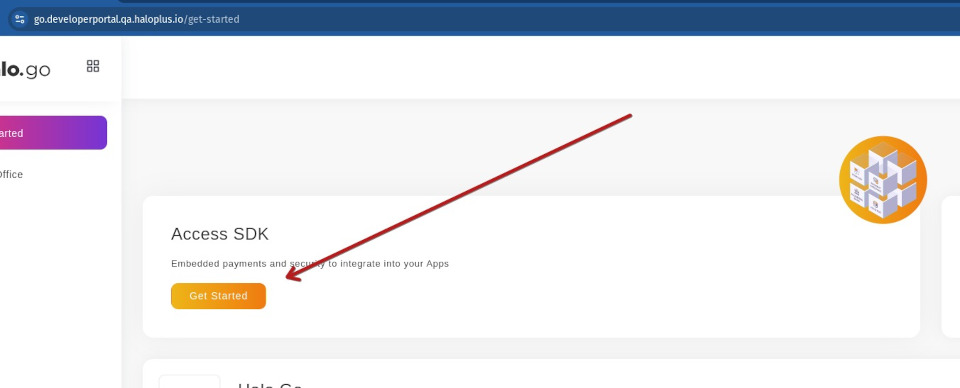
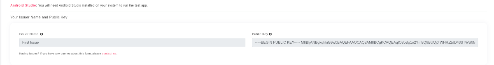
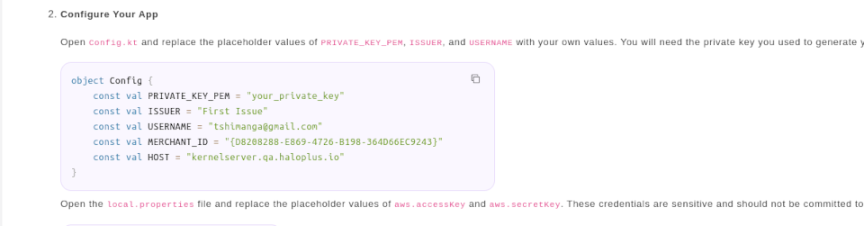

# Halo SDK Flutter Plugin  
  
A flutter implementation of the [Halo Dot SDK](https://halo-dot-developer-docs.gitbook.io/halo-dot/sdk/1.-getting-started).  
  
The Halo Dot SDK is an Isolating MPoC SDK payment processing MPOC Software with Attestation & Monitoring Capabilities.  
  
The Architecture of this isolating MPoC Payment Software is described in the diagram below.  
  
The below diagram also showcases the SDK boundary and the interaction between the SDK its integrating channels, and the 3rd party payment gateway. It also describes the boundary of the SDK and how it interacts with integrators and the third party payments. It also includes details of how the data is communicated sent in-between the boundary.  
  
  
  
## Table of Content

 - [Requirements](#markdown-header-requirements)
 - [Developer portal registration](#markdown-header-developer-portal-registration)
 - [Getting Started](#markdown-header-getting-started)
	 - [Flutter App](#markdown-header-flutter-app)
	 - [Environment Setup](#markdown-header-environment)
	 - [Plugin Installation](#markdown-header-plugin-installation)
	 - [Requirements on the Mobile Back-End](#markdown-header-equirements-on-the-mobile-back-end)
		 - [JWT](#markdown-header-jwt)
		 - [JWT Lifetime](#markdown-header-jwt-lifetime)
		 - [JWT Signing Public Key Format](#markdown-header-jwt-signing-public-key-format)
		 - [JWT Serialization Format](#markdown-header-jwt-serialization-format)
		 - [JWT Claims](#markdown-header-jwt-claims)
	 - [Usage](#markdown-header-usage)
	 - [FAQ](#markdown-header-faq)


## Requirements

The following is a list of requirements needed to implement the Halo Dot SDK

 - A developers account (Register at the [developer portal])
 - Sign a Non Disclosure Agreement (NDA) 
 - A public key and private key to generate a JWT
 - [Kotlin] ^1.3.72 *(@note: a higher version is in work)*
 - [Flutter] ^2.10.5 *(@note: a higher version is in work)* <br/> If you have a different version we can recommend using [fvm]
 - [Dart] ^2.9.2 *(@note: a higher version is in work)*
 - [Java] 11
 - IDE ([Android Studio Preferably](https://developer.android.com/studio/install))
 - Recommended Libraries
	 - [permission_handler] : ^11.0.0
	 - [dart_jsonwebtoken] : ^2.4.2
 - FAQ

## Developer portal registration

You are required to register on our QA (test environment) before testing in production.<br/>The developer portal enables you to 

 1. Accept the Non Disclosure Agreement
 2. Access the SDK
 3. Submit your public key
 4. Give you details for your JWT

### Registration
* Access the [developer portal] and register
* Verify your account through OTP
* Click on access to the SDK 
* Download and Accept the Non Disclosure Agreement
* Submit your public key and create an Issuer name. This will be used to verify the JWT you will create. 
* Access key and Secret key will be created. This will be used in your IDE to access the Halo SDK [see where it is used](#plugin-Installation)  

## Getting started  

Make sure you have your environment set up to build Flutter apps. You can follow the instructions [here](https://flutter.dev/docs/get-started/install). 

### Flutter App
Create a Flutter app or integrate it into your current application.<br/> Ensure that Android and IOs platforms are added, they are currently the only supported platforms.
```bash
#using flutter
flutter create . --project-name my_sdk_flutter_plugin --org za.co.synthesis.halo.test.plugin
#using fvm
fvm spawn 2.10.5 create . --project-name my_sdk_flutter_plugin --org za.co.synthesis.halo.test.plugin
```
  
### Environment  
  
The Android SDK that is implemented was built with [Kotlin] `1.3.72`, your project should be on the same version (>= `1.4.x` has breaking changes).  
  
Check this in your `android/build.gradle` file. You should have something like this:  
See FAQ if your file looks different
  
```gradle  
ext {  
 kotlin_version = '1.3.72'  <-- version defined here  
 buildscript {  
   dependencies { 
     // ... classpath "org.jetbrains.kotlin:kotlin-gradle-plugin:$kotlin_version" // <-- version used here 
   }
 }  
```  
  
3. The SDK was tested using [Java] 11. We cannot confirm yet if anything before or later will work.  
  
4. The SDK was tested using [Flutter] `2.10.5` and [Dart] `2.16.2` (DevTools `2.9.2`).  
  
5. The `minSdkVersion` for the Android project should be `29` or higher. Check this in your `android/app/build.gradle` file:  
6. See the FAQ if you have issue with setting the minSdkVersion
```gradle  
defaultConfig {  
  applicationId "za.co.synthesis.halo.sdkflutterplugin_example" 
  minSdkVersion 29 // <-- this should be 29 or higher 
  // ...
}  
```  
  
### Plugin Installation  
  
1. Run `flutter pub add halo_sdk_flutter_plugin` to add the flutter plugin to your flutter project  
2. We recommend also installing `flutter pub add permission_handler`  
3. The plugin will need to download the SDK binaries from the Halo S3 bucket.<br/>To do this, you will need credentials to access the SDK. Find your `accesskey` and `secretkey` [Developer portal] . <br/>Add these to your `local.properties` file in your android root folder (create one if it doesn't exist):  
  
```properties  
aws.accesskey=<accesskey>  
aws.secretkey=<secretkey>  
```  
  
**NB: mind the casing of the values**
  
4. Then add this to your `android/app/build.gradle` file (this might already exist):  
  
```gradle  
def localProperties = new Properties()  
def localPropertiesFile = rootProject.file('local.properties')  
if (localPropertiesFile.exists()) {  
 localPropertiesFile.withReader('UTF-8') { reader -> localProperties.load(reader) }}  
```  
  
4. Finally make sure you have Maven Central for [Kotlin] `1.3.72` and some more config in the `android/build.gradle` file:  
```gradle  
allprojects {  
 repositories { 
   google()
   mavenCentral() // <-- add this for kotlin 1.3.72 
   maven { url 'https://jitpack.io' }  
   // add this block 
   configurations.all { 
     resolutionStrategy.cacheChangingModulesFor 1, 'days'
     resolutionStrategy.dependencySubstitution { 
       substitute(module("androidx.core:core-ktx")).with(module("androidx.core:core-ktx:(*, 1.3.2]")) 
       substitute(module("org.jetbrains.kotlin:kotlin-stdlib-jdk7")).with(module("org.jetbrains.kotlin:kotlin-stdlib-jdk7:(*, 1.3.72]")) 
       substitute(module("org.jetbrains.kotlin:kotlin-stdlib-jdk8")).with(module("org.jetbrains.kotlin:kotlin-stdlib-jdk7:(*, 1.3.72]")) 
       substitute(module("androidx.window:window-java")).with(module("androidx.core:core-ktx:(*, 1.3.2]")) 
       substitute(module("com.google.firebase:firebase-analytics-ktx")).with(module("com.google.firebase:firebase-analytics-ktx:19.0.0")) 
     } 
   } 
 } 
 // ...
}  
```  
  
### Requirements on the Mobile Back-End  
  
#### JWT  
  
All calls made to the Halo.SDK requires a valid JWT. <br/> The details to create the JWT can be found on the [Developer portal]. <br/>See the section [registration](#registration)
We recommend installing `flutter pub add dart_jsonwebtoken` to generate the JWT.

Our recommendation is to the creation of the JWT.<br/>
Create two files `config.dart` where you will keep the credentials and `jwt_token.dart` which will be used to create the JWT. 
**config.dart**
```dart
class Config {  
  static const String privateKeyPem = String.fromEnvironment('PRIVATE_KEY', defaultValue: '');  
  static const String issuer = "{get from the [Developer portal]}";  
  static const String username = "{get from the [Developer portal]";  
  static const String merchantId = "{get from the [Developer portal]";  
  static const String host = "{get from the [Developer portal]";  
  static const String aud = "{get from the [Developer portal]"; 
  static const String ksk = "{get from the [Developer portal]";     
}
```
**jwt_token.dart**
```dart
import 'package:dart_jsonwebtoken/dart_jsonwebtoken.dart';  
import './config.dart';  // include the above config file
  
class JwtToken {  
  static String getJwt() {  
    final jwt = JWT(  
      {'aud_fingerprints': Config.aud, 'ksk_pin': Config.ksk, 'usr': Config.username},  
      audience: Audience([Config.host]),  
      issuer: Config.issuer,  
      subject: Config.merchantId,  
    );  
  
    final key = RSAPrivateKey(Config.privateKeyPem);  
    final token = jwt.sign(key, algorithm: JWTAlgorithm.RS512);  
    return token;  
  }  
}
```
The private key should not be stored in the repo.

  
You should provide this JWT to the callback function when `onRequestJWT` is invoked by the Halo Dot SDK.  
  
#### JWT LifeTime  
  
Since the JWT essentially authorizes payment acceptance for a given merchant user, it is essential that the JWT lifetime be kept as short as possible, in order to limit the amount of time an attacker has to crack the key itself and then to limit the scope of damage in the event of a key compromise.  
  
A lifetime of 15 minutes is recommended.  
  
#### JWT Signing Public Key Format  
  
The JWT public key should be published as a certificate, in a text-friendly format, e.g. B64 encoded PEM (.crt, .pem).  
  
#### JWT Claims  
  
The JWT must make a number of claims - all of them standard except for `aud_fingerprints` (Audience Fingerprints):  
  
| field | type | Note |
| ---- | ---- | ---- | 
| alg | String |The signing algorithm is RSA signed SHA-256 hash, aliased as RS256. An asymmetric encryption(signing) scheme is required to allow the Kernel Server to be able to validate the token without being able to generate it. If symmetric key encryption was used to sign the auth token (e.g., using the HMAC algorithm), then non-repudiation would be lost. |
| sub | String | The Payment Processor Merchant-User ID, or Application ID |
| iss | String | This is a unique (from the perspective of Halo server) identifier for the JWT issuer, agreed upon by the JWT issuer and Synthesis, and configured in advance by Synthesis in the Halo server, e.g. authserver.haloplus.io. This can be retrieved at the [Developer portal] |
| aud | String | URL of Halo server TLS endpoint, e.g. 'kernelserver.qa.haloplus.io'. This value should be obtained from Synthesis (different per environment) e.g. for QA it would be 'kernelserver.qa.haloplus.io' and for DEV 'kernelserver.za.dev.haloplus.io' |
| usr | String | The details of the user performing the transaction, typically the username used to sign into the Integrators application. |
| iat | NumericDate | The UTC timestamp of when the JWT was generated. |
| exp | NumericDate | The UTC time of expiration of the JWT. |
| aud_fingerprints | String | a CSV list of expected SHA-256 fingerprints for the Kernel Server TLS endpoint. This list may contain multiple values to support certificate rotation. In the QA environment, the expected value as of writing this would be: "sha256/zc6c97JhKPZUa+rIrVqjknDE1lDcDK77G41sDo+1ay0=" |
  
All these values can be validated by making a request to `https://kernelserver.qa.haloplus.io/<sdk-version>/tokens/checkjwt`.   
</br>Method: `POST`  
</br>Header: Bearer Auth  
  
### Usage  
  
1. First you need to request the permissions needed by the SDK. Add the following permissions to your `AndroidManifest.xml` file:  

```xml
<manifest xmlns:android="http://schemas.android.com/apk/res/android"
    package="za.co.synthesis.halo.sdkflutterplugin_example">
    <uses-permission android:name="android.permission.INTERNET"/>
    <uses-permission android:name="android.permission.NFC"/>
    <uses-permission android:name="android.permission.CAMERA"/>
    <uses-permission android:name="android.permission.ACCESS_COARSE_LOCATION"/>
    <uses-permission android:name="android.permission.READ_PHONE_STATE"/>
    <uses-permission android:name="android.permission.MODIFY_AUDIO_SETTINGS"/>
    <uses-permission android:name="android.permission.VIBRATE"/>
    <!--  ....  -->
</manifest xmlns:android="http://schemas.android.com/apk/res/android">
```
  
2. Add the plugin to help you request permissions in your Flutter application. Add the following to your `pubspec.yaml` file:  
```yaml  
dependencies:  
 permission_handler: ^11.0.0 # ...  
```  
Notice the version, later versions expect a higher version of Flutter and Dart.<br/> Also if you use this plugin. Be sure in your `android/app/build.gradle` your `compileSdkVersion` and `targetSdkVersion` are at `34` or higher.  
  
<strong>Remember to run `flutter pub get` after making changes to your pubspec file</strong>  
  
3. Request the permissions in your Flutter application before initializing the SDK. Here is an example of how to do this (please handle cases where the user denies the permissions):  <br/> We recommend you create a file called `permission.dart` that will request all needed permissions, see below.
  
```dart
Future<void> checkPermissions() async {
  var permissions = [
    Permission.camera,
    Permission.phone,
    Permission.storage,
    Permission.notification,
    Permission.location,
  ];

  for (var permission in permissions) {
    await requestPermission(permission);
  }
}

Future<void> requestPermission(Permission permission) async {
  var permissionStatus = await permission.status;
  if (permissionStatus.isGranted) {
    debugPrint("${permission} permission is granted, not requesting");
  } else if (permissionStatus.isPermanentlyDenied) {
    debugPrint("${permission} permission is permanently denied, enable in settings");
  } else {
    var requestResult = await permission.request();

    if (requestResult.isGranted) {
      debugPrint("${permission} permission is granted");
    } else if (requestResult.isPermanentlyDenied) {
      debugPrint("${permission} permission is permanently denied, enable in settings");
    }
  }
}
```
  
4. Your Android `MainActivity` (usually located @ *app/src/main/AndroidManifest.xml*) class should extend `HaloActivity` which hooks into the SDK lifecycle methods for you. (FYI: `HaloActivity` extends `FlutterFragmentActivity`).  
  
e.g  
```kotlin  
import za.co.synthesis.halo.sdkflutterplugin.HaloActivity  
  
class MainActivity: HaloActivity() {  
}  
```  
  
5. In your Flutter project, you can now use the plugin to interact with the SDK. Here is an example of how to use the plugin:  
  
- First you have to implement the `IHaloCallbacks` interface in your Flutter project. This will allow you to receive callbacks from the SDK. Here is an example of how to do this:  
  
```dart
// call this file halo_sdk.dart
import './jwt_token';
class HaloCallbacks implements IHaloCallbacks {
  @override
  void onAttestationError(HaloAttestationHealthResult details) {
    debugPrint("example app: attestation error: $details");
  }

  @override
  void onHaloTransactionResult(HaloTransactionResult result) {
    debugPrint("example app: transaction result: $result");
  }

  @override
  void onHaloUIMessage(HaloUIMessage message) {
    debugPrint("example app: UI message: $message");
  }

  @override
  void onInitializationResult(HaloInitializationResult result) {
    debugPrint("example app: initialization message: $result");
  }

  @override
  void onRequestJWT(void Function(String jwt) callback) {
    debugPrint("example app: onRequestJWT");
    // JwtToken is imported from jwt_token.dart
    var jwt = JwtToken.getJwt(); // you need to pass the created JWT.
    callback(jwt);
  }

  @override
  void onSecurityError(errorCode) {
    debugPrint("example app: security error: $errorCode");
  }
}
``` 
You can decide, based on what the SDK sends via the callbacks, how you would like to affect the UI  
  
- Next you want to initialize the SDK, ideally when the Widget that will handle the transaction is opened. Here is an example of how to do this:  
```dart  
void onInitializeSdk(BuildContext context) {  
  var haloCallbacks = HaloCallbacks(); // Class is define in previous code above 
  String package = "za.co.synthesis.halo.sdkflutterplugin_example"; 
  String appVersion = "0.0.2";
  int onStartTransactionTimeOut = 300000;
  try {  
    Sdkflutterplugin.initializeHaloSDK(haloCallbacks, package, appVersion, onStartTransactionTimeOut);  
  } on PlatformException catch (e) {  
    String message = "SDK initialisation error: ${e.code} ${e.message}";  
    setUiMessage(UiMessage(message, Colors.red));  
  }  
}  
```  
  
- Next you can start a transaction. Here is an example of how to do this:  
```dart  
Sdkflutterplugin.startTransaction(1.00, 'Some merchant reference', 'ZAR');  
```  
  
From this point, a number of UI messages will be pushed to the registered callbacks.  
You will use this to show the user the appropriate UI/text.

## FAQ

My `android/build.gradle` looks different
: New version of android studio have the version of [Kotlin] set as `ext.kotlin_version = '1.3.72'`

How do I set my `compileSdkVersion` if it is currently set as `flutter.compileSdkVersion`
: You can set the `compileSdkVersion` in the `local.properties` file
```
sdk.dir=/home/{me}/android-sdk/  
flutter.sdk=/home/{me}/fvm/versions/2.10.5  
flutter.buildMode=debug  
flutter.versionName=1.0.0  
flutter.versionCode=1  
flutter.compileSdkVersion=34  
flutter.minSdkVersion=29
```
You can then reference this in `android/app/build.gradle` file
```gradle
  compileSdkVersion localProperties.getProperty('flutter.compileSdkVersion').toInteger()
```

How do I set my `minSdkVersion` if it is currently set as `flutter.minSdkVersion` 
: See answer above 

I am not able to import the Halo SDK.
: * Try opening the android folder from Android studio and running gradle sync
: * Ensure you have the plugin install `flutter pub add halo_sdk_flutter_plugin`
: *  Ensure you have the correct [Java] 11, [Kotlin] ^1.3.72, [Flutter] ^2.10.5
: * Ensure that the `minSdkVersion` = 29 or above
: * Ensure that the `compileSdkVersion`and `targetSdkVersion` are at `34` or higher
: * You have the correct `accesskey` and `secretkey` setup in `local.properties`

[developer portal]:https://go.developerportal.qa.haloplus.io/
[dart_jsonwebtoken]:https://pub.dev/packages/dart_jsonwebtoken
[permission_handler]:https://pub.dev/packages/permission_handler
[fvm]:https://fvm.app/
[Dart]: https://dart.dev/
[Flutter]:https://flutter.dev
[Kotlin]:https://kotlinlang.org/
[Java]:https://www.java.com/en/
